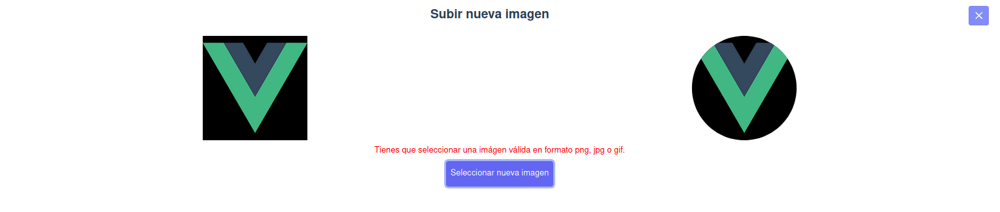

# Vue Image Cropper (WIP status)

This component is in beta phase.

Will reach version 1.0.0 when you have an acceptable state for use.

---

This component helps cut out images by maintaining the proportions and leaving it in the size established based on the width (eg: 150px, 400px, 600px) 

Also allows to store the result on base64 within an input with the name we predefined or upload it to an API.

---




---

Este componente ayuda a recortar imágenes manteniendo las proporciones y dejándola en el tamaño establecido en base al ancho (EJ: 150px, 400px, 600px)

Además permite almacenar el resultado en base64 dentro de un input con el nombre que predefinamos o subirlo a una api.


## Features and Work In Progress

- [x] Set start image path (prop: image_path)
- [x] Set preview rounded (prop: rounded)
- [x] Set width of result (prop: width)
- [x] Set preview width (prop: preview_width)
- [x] Set preview input name (prop: input_name)
- [x] Set Aspect Ratio 1, 1/2, 1/4, 16/9, 21/9... (prop: aspect_ratio)
- [x] Set API url (prop: api_url)
- [ ] Set Lazy Image path
- [ ] Upload to API
- [ ] Set enable API upload

## Plain Html Project

```html
<script src="https://unpkg.com/vue"></script>
<script src="./CropperImage.umd.js"></script>

<div id="app">
  <v-cropper-image 
    preview_width="150"
    image_path="./images/example.jpg"
    aspect_ratio="1/4"
    input_name="user_avatar"
    width="150"
    ></v-cropper-image>
</div>

<script>
new Vue({
  components: {
    "v-cropper-image": CropperImage
  }
}).$mount('#app')
</script>
```

## Laravel or JS Project

```html
<v-cropper-image 
    preview_width="150"
    image_path="./images/example.jpg"
    aspect_ratio="1/4"
    input_name="user_avatar"
    width="150"
    ></v-cropper-image>
```

```js
require('vue-component-image-cropper/dist/CropperImage.umd.min.js');

const app = new Vue({
    el: '#app',
    components: {
        'v-cropper-image': CropperImage
    }
});
```